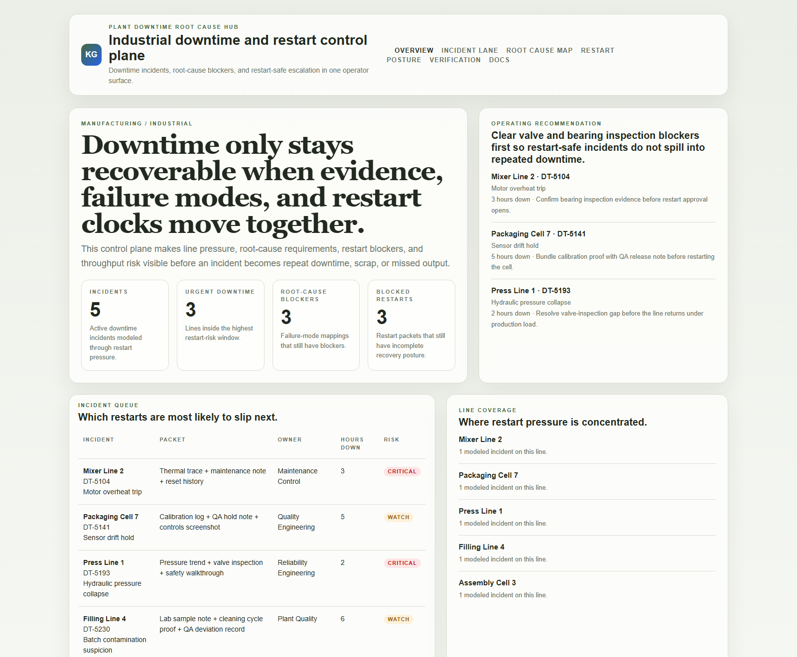
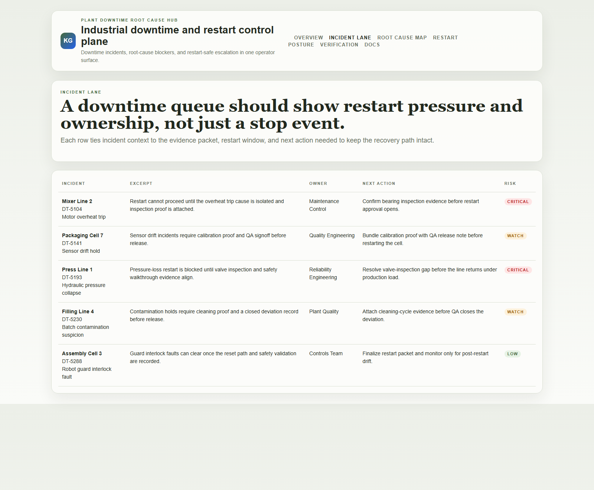
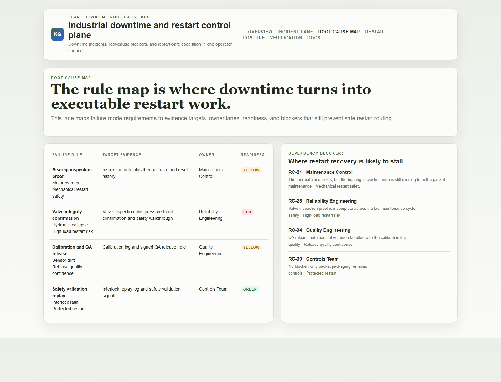
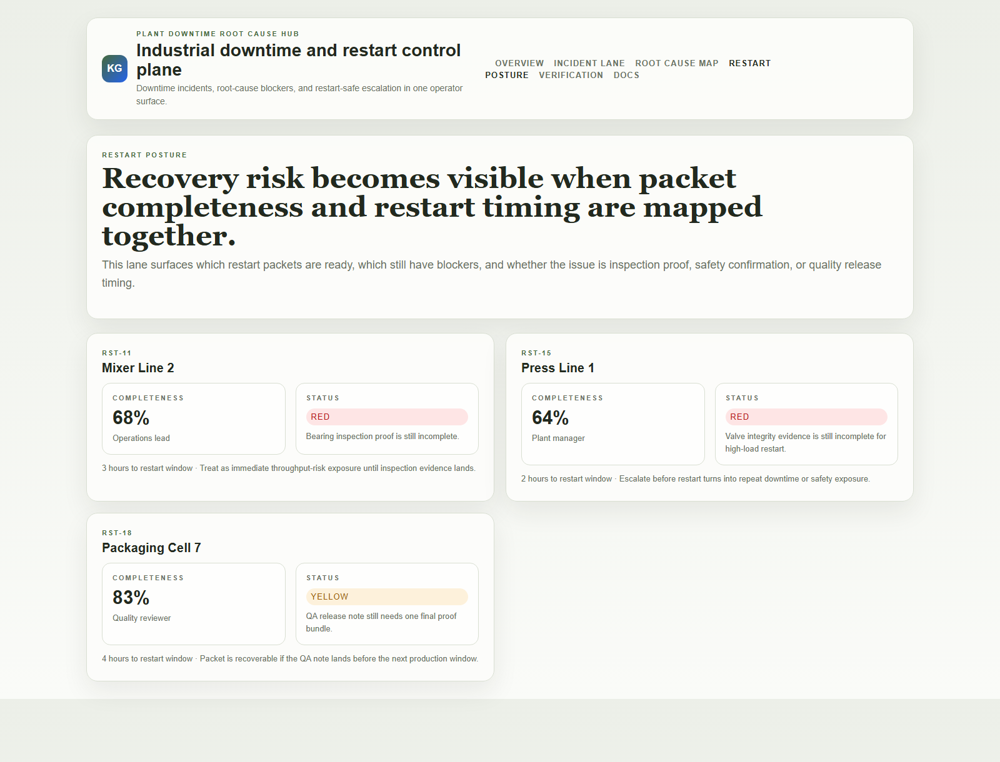

# Plant Downtime Root Cause Hub

TypeScript control plane for downtime incident intake, root-cause pressure, maintenance routing, and restart-safe escalation across industrial operations.

## Why this exists

- Plant teams lose time when incident notes, maintenance evidence, and restart blockers live in separate systems.
- Downtime often expands because the handoff between operations, maintenance, and quality breaks down under pressure.
- Industrial leaders need to know which line is blocked, who owns the next move, and whether restart is actually safe.
- Manufacturing buyers care whether downtime handling is auditable and execution-safe, not whether the dashboard uses generic AI language.

## Why this matters (KG Embedded tie-back)

This repo demonstrates the root-cause routing primitive for Manufacturing / Industrial buyers: downtime incidents tied to failure modes, restart blockers, and operator-safe escalation paths. A B2B SaaS buyer would care because incident and maintenance data often need to surface inside customer-facing tools without exposing unsafe write paths or fragmented operational evidence. Kinetic Gain Embedded extends this into security-first in-product analytics for reliability-aware and restart-aware reporting across industrial and operations workflows, see [kineticgain.com/embedded](https://kineticgain.com/embedded).

## Routes

- `/`
- `/incident-lane`
- `/root-cause-map`
- `/restart-posture`
- `/verification`
- `/docs`

## API

- `/api/dashboard/summary`
- `/api/incident-lane`
- `/api/root-cause-map`
- `/api/restart-posture`
- `/api/verification`
- `/api/sample`

## Screenshots






## Local Development

```powershell
cd plant-downtime-root-cause-hub
npm install
npm run dev
```

Open:
- [http://127.0.0.1:5474/](http://127.0.0.1:5474/)
- [http://127.0.0.1:5474/incident-lane](http://127.0.0.1:5474/incident-lane)
- [http://127.0.0.1:5474/root-cause-map](http://127.0.0.1:5474/root-cause-map)
- [http://127.0.0.1:5474/restart-posture](http://127.0.0.1:5474/restart-posture)
- [http://127.0.0.1:5474/verification](http://127.0.0.1:5474/verification)

## Validation

- `npm run build`
- `npm run test`
- `npm run demo`
- `npm run smoke`
- `npm run render:assets`

## Docs

- [Architecture](./docs/architecture.md)
- [Origin](./docs/ORIGIN.md)
- [Kinetic Gain Embedded tie-back](./docs/KINETIC_GAIN_EMBEDDED.md)
- [Changelog](./CHANGELOG.md)
